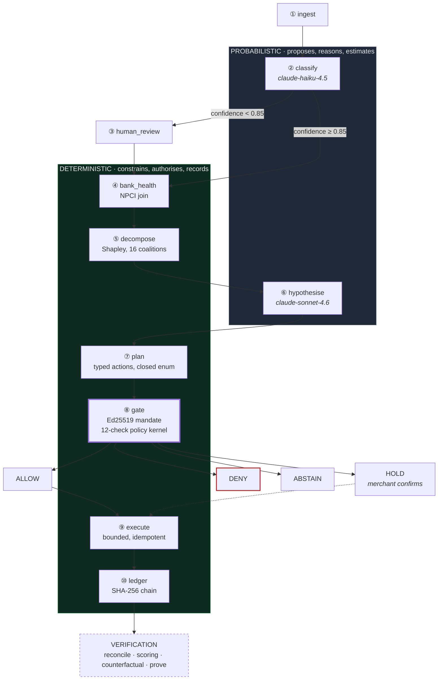

<div align="center">

# VERITAS

### Recover what you can. Prove what happened.

[](https://github.com/2005-Aneeshdutt/veritas/actions/workflows/ci.yml)
[](https://www.python.org/downloads/)
[](https://react.dev/)
[](LICENSE)

**Razorpay AI Buildathon 2026 · Track 03: AI Revenue Recovery**
Aneesh Dutt · PES University

</div>

---

A recovery agent reads a failed payment and proposes an action. A deterministic
policy kernel it does not control decides whether that action is permitted at
all. Every rupee it ends up claiming is marked against an outcome it never saw
when it decided — and each decision is written to a hash chain before the
outcome is known, so the final number can be recomputed by anyone who doubts it.

> **The model proposes. The kernel decides. The ledger remembers.**

---

## Contents

- [The problem](#the-problem)
- [Architecture](#architecture)
- [Quick start](#quick-start)
- [Repository layout](#repository-layout)
- [Core concepts](#core-concepts)
- [The numbers, and what they mean](#the-numbers-and-what-they-mean)
- [Verifying the claims](#verifying-the-claims)
- [Testing](#testing)
- [Limitations](#limitations)
- [Further reading](#further-reading)

---

## The problem

Indian merchants lose a recurring slice of revenue to payments that fail for
reasons that resolve on their own — a soft decline, a bank timeout, a limit that
resets tomorrow, an issuer under momentary load. Retrying those is not
technically difficult.

The reason it does not happen autonomously at scale is that **nobody will hand
an agent a payments API and let it re-charge real customers unsupervised.** The
blocker is authority, not capability.

VERITAS is not a smarter retry engine. It is the layer that makes one safe to
switch on:

| | |
|---|---|
| **A signed mandate** | Ed25519, issued by the merchant. Bounds amount, attempts, timing, and which action types may even be proposed. |
| **A deterministic kernel** | Twelve checks against that mandate, every time, before money moves. A model never authorises anything. |
| **A hash-chained ledger** | Every decision recorded before its outcome is known, so the claim at the end is recomputable rather than asserted. |

---

## Architecture

Two of the ten pipeline stages call a language model. The other eight —
attribution, bank health, authorisation, execution, the ledger — are ordinary
deterministic code. That split is the design, not an implementation detail.



**The model never holds a credential and never emits an action.** It emits a
`ProposedAction` — a validated struct drawn from a closed enum — which the
kernel then accepts or rejects. A fully prompt-injected model still cannot
exceed the mandate, because it never held the signing key and its output is
parsed rather than executed.

Deeper treatment, including the security argument and the decomposition maths,
is in [`ARCHITECTURE.md`](ARCHITECTURE.md).

---

## Quick start

**Requirements:** Python 3.11+, Node 22+. No API key — every model response the
demo needs is cached and committed.

```bash
make setup      # python + console dependencies
make demo       # engine on :8000, console on :8080
```

Then open **http://localhost:8080**.

<details>
<summary>Running the two halves separately</summary>

```bash
# engine
pip install -e ".[dev]"
uvicorn doctor.api:app --port 8000

# console — needs console/.env with VITE_API_BASE_URL=http://127.0.0.1:8000
cd console && npm install && npm run dev
```

Use `127.0.0.1`, not `localhost`. The console server-renders, and Node resolves
`localhost` to `::1` first while uvicorn binds IPv4 only — so `localhost` works
in the browser and fails during SSR, surfacing as a blank page that names
nothing.

</details>

**Deployment.** `render.yaml` defines the API service. The console is not
deployed there and the config does not pretend otherwise: its production build
targets a serverless runtime rather than a Node server, and `VITE_API_BASE_URL`
compiles into the client bundle at build time. Clone-and-run is the supported
path today.

---

## Repository layout

Two halves of one product, so a single link is the whole thing.

```
veritas/
├── src/
│   ├── doctor/            engine — pipeline, API (64 routes), recovery, prove
│   └── chitragupta/       authority — mandate, policy kernel, hash-chained ledger
├── console/               operator console — React 19 · TanStack Start
│   └── src/routes/        13 surfaces, one file per page
├── data/
│   ├── runs/              8 committed runs — the book every figure comes from
│   └── mandates/          signed mandates (private keys are gitignored)
├── llm_cache/             every model response, keyed by a hash of its input
├── evals/                 validation sweeps against held-out merchants
├── tests/                 825 tests
└── docs/
    ├── ENGINEERING.md     the long-form design dossier
    ├── npci_finding.md    what 32 months of NPCI data say
    └── what_broke.md      failures found during the build
```

The console has [its own README](console/README.md) covering its pages, the
guided walk, and its data rules.

---

## Core concepts

### The mandate

A merchant signs a document; the agent operates strictly inside it. For the
demo merchant:

| Bound | Value |
|---|---|
| Hard ceiling | ₹15,000 |
| May act alone under | ₹3,000 |
| Attempts per payment | 3 |
| Permitted action types | 7 — nothing outside the list can be *proposed* |
| Signature | Ed25519, verified before any check runs |

### The policy kernel

Twelve deterministic checks, in order, on every proposed action. The first
failure stops evaluation — and the checks after it are recorded as **never
evaluated**, not as failures, because not-evaluated is not the same as passed.

Outcomes are `ALLOW`, `STEP_UP` (a person must confirm), or `DENY`. The Control
Tower maps these plus downstream state into five operator states:
`auto_allow · hold · deny · escalate · human_review`.

### The claim ladder

Different claims, labelled differently, never collapsed into one number:

| Claim | Means |
|---|---|
| `MEASURED` | Retried, and marked against a held-out outcome the engine never saw |
| `PROJECTED` | A forecast, with an error bar |
| `OBSERVED` | Seen in the data, cause not established |
| `UNVERIFIED` | Acted; outcome could not be established |
| `ABSTAINED` | No claim made |

A gateway capture is *not* a recovery. Razorpay confirming a payment is the
gateway's claim; ours requires the held-out outcome.

### The ledger

SHA-256 chain with the actor inside the hash, appended before the outcome is
known. **1,057 entries across 8 runs; all 8 chains verify from genesis.**

---

## The numbers, and what they mean

Across 8 merchants in the committed book:

| Figure | Amount | Claim |
|---|---:|---|
| At risk | ₹64,24,667 | total failed-payment value |
| Recoverable | ₹5,56,225 | `PROJECTED` — a forecast, labelled as one |
| **Measured recovery** | **₹39,834** | `MEASURED` — 67 payments that actually converted |
| Held for a person | ₹16,11,536 | proposed, awaiting confirmation |
| Refused by mandate | ₹3,13,911 | 16 actions the kernel would not authorise |

Two of the eight merchants recovered nothing, and are still in the book.

---

## Verifying the claims

Every number here is checkable without trusting the narrative.

```bash
# the ledger recomputes the headline from its own entries — 98 checks, 8 runs
curl localhost:8000/api/reconcile/run_beec9668 | jq '.ok, .chain_verified'

# regenerate everything; fails if a single committed number moves
python scripts/verify_reproducibility.py

# a full diagnosis with no API key configured, proving the cache is complete
PYTHONPATH=src python -m doctor.run --merchant quickmart
```

The last one writes a fresh run to `data/runs/` — delete it afterwards if you
want the book back at its committed eight.

CI runs four jobs on every push: the test suite, **a full diagnosis with no API
key**, **a reproducibility check that fails if a committed number changes**, and
the console build.

**Determinism is a deliverable.** Both model calls run at temperature 0 and
every response is cached under a hash of exactly what was sent, so a run replays
byte-identically offline at zero marginal cost.

---

## Testing

```bash
pytest -q                       # 825 tests
cd console && npx tsc --noEmit  # console typecheck
```

Some tests re-sign a narrowed mandate with a merchant's real Ed25519 key to
exercise the true authorisation path. Those private keys are gitignored, so
those tests **skip** rather than assert against a fallback on a fresh checkout.
Generate them if you want full coverage:

```bash
python -m chitragupta.mandate --generate --merchant cloudsync \
    --auto-limit-paise 300000 --ceiling-paise 1500000
```

---

## Limitations

Stated before they are asked.

1. **The book is generated, not production traffic.** It carries held-out
   ground truth so the engine can be scored blind — which is the point — but it
   is not a real merchant's ledger.
2. **Razorpay runs in test mode.** The webhooks, signature verification and
   idempotency are real; the money is not. Test-mode transactions are never
   added to the measured total.
3. **The Audit Ledger page shows no walkthrough payments.** It reads only the
   60 most recent of 1,057 entries and maps both hash fields to empty strings.
   The data is intact — `/api/run/{run_id}` → `report.ledger` has every payment
   with both hashes — and the fix is to source the case-filtered view from the
   run's own ledger. Open, and known.

---

## Further reading

| Document | What it covers |
|---|---|
| [`ARCHITECTURE.md`](ARCHITECTURE.md) | The graph, the security property, the decomposition, determinism |
| [`docs/ENGINEERING.md`](docs/ENGINEERING.md) | Long-form design dossier — the counterfactual lab, the autonomy frontier, where it degrades |
| [`docs/npci_finding.md`](docs/npci_finding.md) | What 32 months of NPCI data actually say |
| [`docs/what_broke.md`](docs/what_broke.md) | Failures found during the build, and what they cost |
| [`console/README.md`](console/README.md) | The console: pages, guided walk, data rules |

---

## License

[Apache License 2.0](LICENSE).
